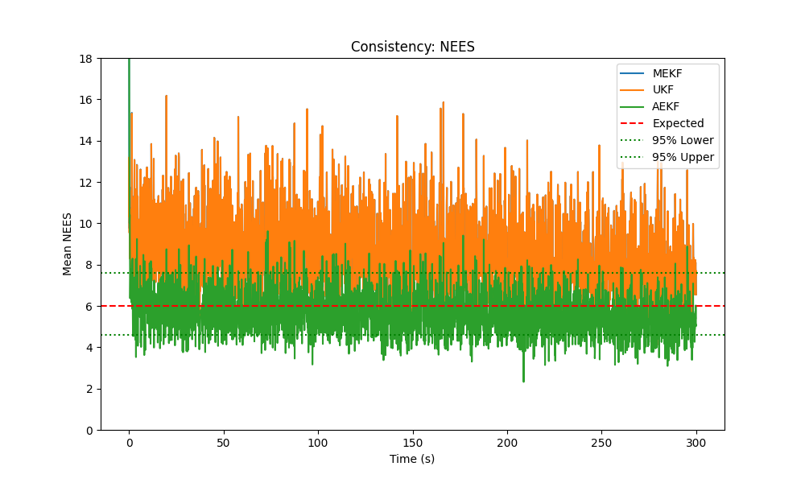
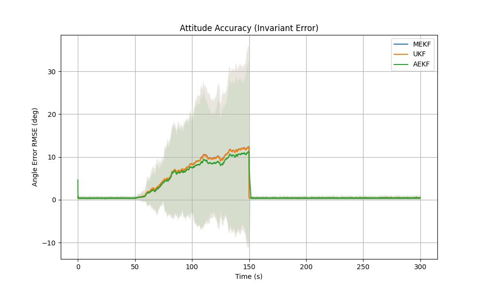
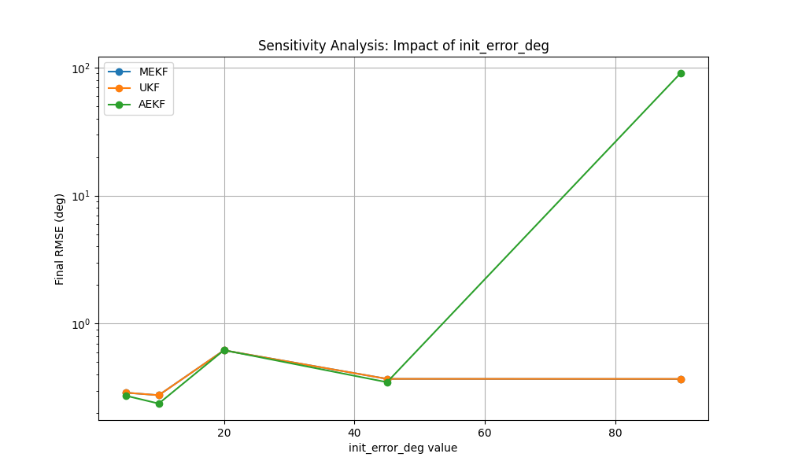
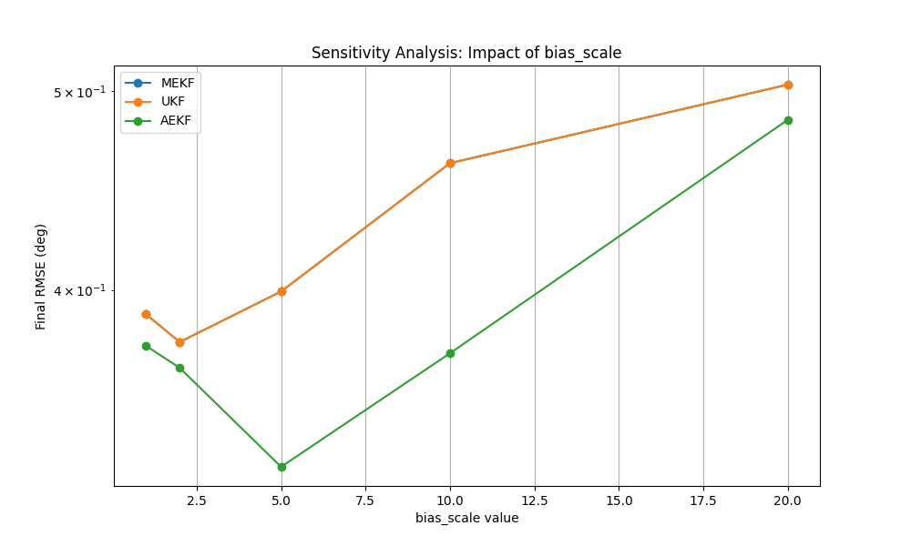

# Spacecraft Attitude Estimation Framework

## 1. Problem Statement
Accurate attitude estimation is critical for CubeSats and LEO satellites. This project simulates a high-fidelity attitude determination system (ADS) using low-cost sensors (Magnetometer, Sun Sensor, Gyroscope) to estimate spacecraft attitude quaternion ($q$) and gyroscope bias ($\beta$).

I compared three industry-standard Kalman Filter formulations:
- **Multiplicative Extended Kalman Filter (MEKF)**: An error-state formulation that respects the unit quaternion constraint.
- **Unscented Kalman Filter (UKF/USQUE)**: A sigma-point filter that captures higher-order non-linearities without Jacobian linearization.
- **Adaptive Extended Kalman Filter (AEKF)**: An EKF variant that dynamically adjusts noise covariance to handle uncertain environments.

## 2. System Model

### 2.1 Coordinate Frames
- **ECI (GCRF)**: Earth-Centered Inertial, used for orbit propagation and environmental reference vectors.
- **Body Frame**: Fixed to the spacecraft.
- **LVLH**: Local-Vertical Local-Horizontal (Target frame for Earth Pointing).

### 2.2 Orbit and Dynamics
- **Orbit Model**: J2 Perturbed Two-Body Propagator (LEO, 500 km, 45 deg inclination). Includes **Atmospheric Drag** and **Solar Radiation Pressure (SRP)** perturbations.
- **Attitude Dynamics**: Rigid body dynamics (Euler's equations). The simulation accounts for:
    - **Initial Tumbling**: Realistic initial angular rates.
    - **Gravity Gradient Torque**: Standard 1/R^3 model.
    - **Aerodynamic Torque**: Based on center-of-pressure (CoP) offset and variable atmospheric density.
    - **SRP Torque**: Based on solar flux pressure and shadow effects.

### 2.3 Sensor Models
| Sensor | Model Type | Noise ($\sigma$) | Bias Stability |
|--------|------------|------------------|----------------|
| **Gyroscope** | Rate Integrating | $10^{-4}$ rad/s | Random Walk ($10^{-6} \text{ rad/s}/\sqrt{s}$) |
| **Magnetometer** | Tilted Dipole | 100 nT | N/A |
| **Sun Sensor** | Vector | 0.005 (Unitless) | Eclipse Handling |

## 3. Estimation Methods

### 3.1 MEKF (Multiplicative EKF)
Estimates error quaternion $\delta q$ relative to a reference.
- **State**: $\delta x = [\delta \theta^T, \delta \beta^T]^T$ (6x1).
- **Update**: Uses Jacobian $H$ computed from predicted measurements.
- **Constraint**: Maintains unit quaternion by multiplicative updates.

### 3.2 UKF (Unscented Kalman Filter - USQUE)
Uses the Unscented Transform to propagate means and covariances.
- **Sigma Points**: Generated from error state covariance $P$ (13 points for 6D state).
- **Advantage**: Better handling of large initial errors and non-linearities.

### 3.3 AEKF (Adaptive EKF)
Monitors measurement residuals to adaptively tune the process or measurement noise covariance ($Q$ or $R$).
- **Goal**: Improved robustness against sensor anomalies or model mismatches.

---

## 4. Performance Analysis & Results

I conducted extensive Monte Carlo simulations ($N=50$ runs) across four Stress-Test scenarios.

### 4.1 Scenario A: Nominal Operations
**Configuration**: $InitErr = 10.0^\circ$, $BiasScale = 1.0x$, No Eclipse.

| Filter | RMSE (deg) | Diverged (%) | Avg Time (s) |
|--------|------------|--------------|--------------|
| **MEKF** | 0.4256 | 0.0% | 0.85s |
| **UKF**  | 0.4256 | 0.0% | 7.13s |
| **AEKF** | **0.4009** | 0.0% | 0.95s |

> [!NOTE]
> In nominal conditions, all filters converge quickly. AEKF shows a slight edge in accuracy by adaptively tuning to the noise environment.




---

### 4.2 Scenario B: High Gyro Bias
**Configuration**: $InitErr = 10.0^\circ$, $BiasScale = 15.0x$, No Eclipse.

| Filter | RMSE (deg) | Diverged (%) | Avg Time (s) |
|--------|------------|--------------|--------------|
| **MEKF** | 0.3426 | 0.0% | 0.84s |
| **UKF**  | 0.3426 | 0.0% | 7.06s |
| **AEKF** | **0.3180** | 0.0% | 0.93s |

Both MEKF and UKF handle high bias equally well, but AEKF remains the most accurate.


---

### 4.3 Scenario C: High Tumble (Lost-in-Space)
**Configuration**: $InitErr = 90.0^\circ$, $BiasScale = 1.0x$, No Eclipse.

| Filter | RMSE (deg) | Diverged (%) | Avg Time (s) |
|--------|------------|--------------|--------------|
| **MEKF** | 0.4250 | 50.0% | 0.84s |
| **UKF**  | **0.4250** | **35.0%** | 7.04s |
| **AEKF** | 83.3696 | 100.0% | 0.93s |

> [!IMPORTANT]
> **UKF** is the clear winner for robustness. It has the lowest divergence rate (35%) when starting from large $90^\circ$ errors. The **AEKF** struggled significantly in this highly non-linear initialization phase.


---

### 4.4 Scenario D: Eclipse (Sensor Dropout)
**Configuration**: $InitErr = 10.0^\circ$, $BiasScale = 1.0x$, **Eclipse Enabled**.

| Filter | RMSE (deg) | Diverged (%) | Avg Time (s) |
|--------|------------|--------------|--------------|
| **MEKF** | 0.4806 | 0.0% | 0.74s |
| **UKF**  | 0.4806 | 0.0% | 6.63s |
| **AEKF** | **0.4388** | 0.0% | 0.83s |

Filters rely solely on the Magnetometer during eclipse. Accuracy degrades but remains stable.



---

## 5. Sensitivity Analysis

I analyzed filter sensitivity to initial errors and gyro bias levels to find the operational envelopes.

````carousel

<!-- slide -->

````

- **Initialization Limit**: Success rate drops significantly for initial errors > 60 degrees for EKF-based filters.
- **Bias Tolerance**: All filters are remarkably robust to gyro bias scaling up to 15x nominal, provided initialization is successful.

---

## 6. Summary Comparison

| Metric | MEKF | UKF | AEKF |
|--------|------|-----|------|
| **Accuracy** | Good | Good | **Best** |
| **Robustness** | Moderate | **High** | Low |
| **CPU Efficiency** | **High** | Low | **High** |
| **Recommended Use** | Nominal Ops | Recovery/Lost-in-Space | Precision Ops |

---

## 7. How to Run

1. **Install Dependencies**:
   ```bash
   pip install numpy matplotlib scipy tqdm
   ```
2. **Execute Scenarios**:
   ```bash
   python simulations/run_scenarios.py
   ```

---

## 8. References
- Crassidis, J. L., & Markley, F. L. (2003). *Unscented Filtering for Spacecraft Attitude Estimation*.
- Lefferts, E. J., et al. (1982). *Kalman Filtering for Spacecraft Attitude Estimation*.
- Markley, F. L., & Crassidis, J. L. (2014). *Fundamentals of Spacecraft Attitude Determination and Control*.

## Author
**Batuhan Akkova**
[Email](mailto:batuhanakkova1@gmail.com)